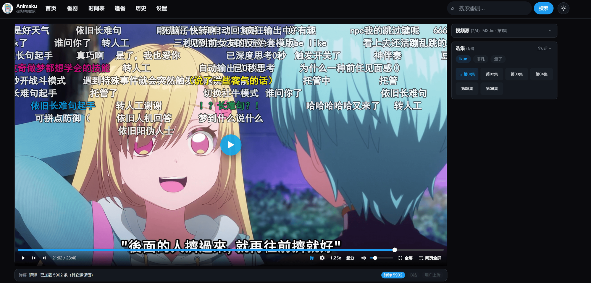

<div align="center">

  <h1>Animaku</h1>

  

  <p>
    
    
    
    
  </p>

  <p>
    浏览器里的番剧应用：基于自定义规则选源播放，搭配
    <a href="https://bangumi.tv/">Bangumi</a> 元数据与
    <a href="https://www.dandanplay.com/">弹弹play</a> 弹幕。<br />
    兼容 <a href="https://github.com/Predidit/KazumiRules">KazumiRules</a>，支持导入与规则商店安装。
    本地历史 / 追番，Anime4K 超分。绝赞开发中 (～￣▽￣)～
  </p>

  <p>
    
  </p>

</div>

## 这是什么

**Animaku** 是 **React SPA + 本地 Hono API** 的自托管 Web 客户端。

| 能力 | 说明 |
|------|------|
| 元数据 | Bangumi 搜索 / 时间表 / 详情 / 分集；可选 Token 同步追番 |
| 选源播放 | 兼容 Kazumi 规则（XPath / API）；多线路选集 |
| 弹幕 | 弹弹 play 匹配；B 站 BV；拖入 bilibili / pakku XML |
| 本地数据 | 历史、设置、规则 JSON 均在浏览器；服务端不落库用户内容 |

没有内嵌 WebView 媒体拦截，播放地址优先靠服务端静态解析 m3u8/mp4；抽不到时可 iframe 嵌源站页降级（跨域、弹幕与续播等能力受限）。

## 支持环境

- **浏览器**：现代 Chromium / Firefox / Safari（播放、HLS、可选 WebGPU 超分）
- **部署（推荐）**：Docker / Compose 单容器 — **只需 Docker，不必装 Node / pnpm**
- **本机生产 / 开发**：Node.js ≥ 20（建议 LTS）+ pnpm **9.15.0**

## 功能

- [x] 番剧首页 / 目录 / 搜索
- [x] 放送时间表
- [x] 番剧详情与分集
- [x] 多视频源 / 多线路选集
- [x] 自定义规则导入与规则商店
- [x] 规则冒烟测试（search → chapters → resolve）
- [x] 原生 `<video>` + hls.js 播放器
- [x] 弹弹弹幕 + 弹幕面板 / 偏移 / 快捷键
- [x] B 站 BV 弹幕与本地 XML 导入
- [x] 追番列表（Bangumi 收藏，需 Token）
- [x] 观看历史与续播
- [x] 倍速 / 自动下一集 / 跳 OP·ED
- [x] 明暗主题
- [x] HLS 广告段过滤
- [x] Anime4K 实时超分（WebGPU，效率 / 质量档）
- [x] 媒体代理与直连回退；iframe 降级
- [x] Docker 一键部署
- [ ] 还有更多 (/・ω・＼)

## 快速开始

多数用户 **只装 Docker 即可**；下面的 pnpm 仅用于本机生产或二次开发。

### Docker 一键部署（推荐）

```bash
git clone https://github.com/uerax/Animaku.git animaku
cd animaku

cp .env.example .env    # 按需改 PORT、PUBLIC_PROXY 等
docker compose up -d --build
```

浏览器打开 **http://localhost:$PORT**（默认 `8787`）。  
单容器同时提供 SPA 与 `/api/*`（同源）。

```bash
docker compose logs -f
docker compose down
```

```bash
# 不用 compose
docker build -t animaku .
docker run --rm -p 8787:8787 --env-file .env -e PORT=8787 -e PUBLIC_PROXY=1 animaku
```

- 健康检查：`GET /api/health`
- 镜像内 `WEB_DIST=public`；进程以非 root（`node`）运行
- `PUBLIC_PROXY` **默认开启**（公网可直接选源/代理）；仅内网可设 `0` 收紧
- 页脚 `VITE_*` 为构建期变量：改完需 `docker compose up -d --build` 才生效

### 本机 Node 生产（无 Docker）

一个进程同时提供 `/api/*` 与 SPA（同源，无需 Vite 代理）：

```bash
# 需 Node ≥ 20 + pnpm 9.15.0，在仓库根目录
pnpm install
cp .env.example .env   # 按需修改
pnpm start:prod
# 等价：pnpm build && pnpm start
```

浏览器打开 **http://localhost:$PORT**（默认 `8787`）。  
`WEB_DIST` 可指定静态目录（相对进程 cwd）；本机可省略，会探测 `public` / `apps/web/dist` 等。

### 本地开发（pnpm）

| 工具 | 版本 |
|------|------|
| Node.js | ≥ 20（建议 LTS） |
| pnpm | **9.15.0**（与 `packageManager` 字段一致） |

```bash
# 安装 pnpm（任选）
npm install -g pnpm@9.15.0
# 或：corepack enable && corepack prepare pnpm@9.15.0 --activate
```

请在 **仓库根目录** 使用 pnpm，不要用 npm / yarn 直接装依赖。

```bash
pnpm install
cp .env.example .env   # 按需修改

pnpm dev
```

| 进程 | 默认地址 | 说明 |
|------|----------|------|
| Web（Vite） | http://localhost:5173（`WEB_DEV_PORT`） | **浏览器只开这个** |
| API（Hono） | http://localhost:8787（`PORT`） | Vite 把 `/api` 代理过来 |

```bash
pnpm dev:web       # 仅前端
pnpm dev:server    # 仅后端
pnpm typecheck     # 全仓 tsc
```

跳过 `pnpm install` 直接 `pnpm dev` 会报找不到 `tsx` / `node_modules missing`。  
日常改代码请用 `pnpm dev`，不要用生产 `start`。

## 使用流程

1. Docker / 本机生产：http://localhost:$PORT · 开发：http://localhost:$WEB_DEV_PORT  
2. **设置 → Bangumi Token**（可选，用于追番）  
3. 规则：默认已内置（`Anime1` / `otage` / `xifan` / `MXdm`）；可导入 JSON 或从 **规则仓库** 安装  
4. 详情页 → 选源 → 选集播放（能直链则浏览器直连 CDN，失败自动回退媒体代理）  
5. 播放页自动匹配弹幕；控制栏「幕」打开面板  

### 播放快捷键

| 键 | 作用 |
|----|------|
| Space / K | 播放 / 暂停 |
| ← / → | ±5s |
| ↑ / ↓ | 音量 |
| F | 播放器全屏 |
| D | 弹幕开关 |
| `,` / `.` / `/` | 弹幕滞后 / 超前 / 偏移复位 |
| Alt+M | 弹幕面板 |
| P / N | 上 / 下一集 |
| 拖入 `.xml` | 导入 B 站 / pakku 弹幕 |

控制栏另有 **网页全屏**（CSS 铺满，不走 Fullscreen API）。  
设置页：默认倍速、自动下一集、续播、跳 OP/ED、超分档位、强制广告过滤 / 媒体代理等。

## 环境变量

完整注释见 [.env.example](.env.example)。服务端从仓库根与 `apps/server` 加载；Vite 读同一份根 `.env`。

### 常用

| 变量 | 默认 | 说明 |
|------|------|------|
| `PORT` / `HOST` | `8787` / `0.0.0.0` | API / 生产单进程监听 |
| `WEB_DEV_PORT` / `WEB_HOST` | `5173` / 代码默认 `127.0.0.1` | **仅本地 Vite**；Docker 生产不用 |
| `DANDAN_APP_ID` / `DANDAN_APP_SECRET` | 空 | 空则用内置 legacy 客户端密钥，开箱可弹幕 |
| `BANGUMI_USER_AGENT` / `PRODUCT_USER_AGENT` | `animaku/0.1` | 上游 UA |

### 页脚 / 项目宣传（可选，Vite `VITE_*`）

非观看页底部展示 GitHub 与可选维护者信息；改后需重新 `pnpm build` / 重启 `pnpm dev`。

| 变量 | 说明 |
|------|------|
| `VITE_GITHUB_URL` | 源码地址（默认 `https://github.com/uerax/Animaku`）；也可写 `owner/repo` |
| `VITE_MAINTAINER_NAME` / `VITE_MAINTAINER_URL` | 维护者显示名与主页链接 |
| `VITE_HOMEPAGE_URL` / `VITE_CONTACT_EMAIL` | 额外主页、联系邮箱 |
| `VITE_SITE_TAGLINE` / `VITE_FOOTER_NOTE` | 标语与附加说明 |

完整列表见 [.env.example](.env.example)。

### SEO（可选）

SPA 默认带 `index.html` meta、客户端按路由改 title/description/OG、以及 `/robots.txt` + `/sitemap.xml`。

| 变量 | 说明 |
|------|------|
| `SITE_URL` | 运行时公网 origin（无尾斜杠），写入 sitemap / robots 的 `Sitemap:` |
| `VITE_SITE_URL` | 构建期写入客户端，供 canonical / `og:url`（Docker 需 rebuild） |

未设置时：服务端用请求 `Host`（含 `X-Forwarded-*`）；客户端用 `window.location.origin`。  
私有页（设置 / 历史 / 追番 / 搜索 / `/play/*`）`noindex`；番剧详情索引在 `/subject/:id`。

### 公网 / 代理访问（重要）

| 变量 | 说明 |
|------|------|
| `PUBLIC_PROXY` | **默认 `1`**：任意客户端可用媒体代理 + 规则 search/chapters/resolve。设 `0` 则仅本机/局域网（或 `PROXY_TOKEN`） |
| `PROXY_TOKEN` | 可选；在 `PUBLIC_PROXY=0` 时可用请求头 `X-Animaku-Proxy-Token` 或 `?proxyToken=` 放行 |
| `CORS_ORIGINS` | 额外允许的浏览器 Origin（逗号分隔）；localhost 始终可用 |

**默认已适合 VPS 公网部署。** 开启后他人也可借你的服务器出口拉流，请知悉带宽风险（仍有内网 SSRF 拦截）。  
仅本机 / 局域网、不希望端口暴露后被公网当出口用时：设 `PUBLIC_PROXY=0`。

## Q&A

<details>
<summary>使用者 Q&A</summary>

#### Q: 为什么少数番剧里有广告？

A: 本项目不插入广告。片源侧广告可能来自 m3u8 分段；可在规则或设置里开启 **广告过滤**（基于 `#EXT-X-DISCONTINUITY` 启发，不是通用广告拦截）。无 DISCONTINUITY 或 iframe 降级时过滤无效。

#### Q: 为什么启用超分辨率后播放卡顿？

A: Anime4K 走浏览器 **WebGPU**，对 GPU 要求较高。尽量选 **效率档** 而非质量档，或对低分辨率源使用；不支持 WebGPU 时请关闭超分。

#### Q: 为什么有的源能搜到却播不了？

A: Web 端没 WebView 拦截能力，只能静态抽链。大量 `resolve` 失败多半是解析上限，可换规则 / 线路，或接受 iframe 降级（弹幕与部分播放增强不可用）。

#### Q: 公网能开页面但不能选源 / 播放？

A: 检查 `.env` / 环境变量是否把 `PUBLIC_PROXY` 设成了 `0`。默认应为 `1`；若刻意收紧，可改回 `1` 或配置 `PROXY_TOKEN`。

#### Q: 弹幕显示「未配置」？

A: 本地可留空 `DANDAN_*` 使用内置密钥。仍失败时查 `/api/danmaku/status` 与服务端日志；生产环境建议申请[弹弹开放平台](https://www.dandanplay.com/)密钥。

#### Q: 有声无画？

A: 多为布局 / 合成问题（例如父级 `overflow` + 圆角与硬解视频叠加）。详见 [docs/CONTEXT.md](docs/CONTEXT.md)。

</details>

<details>
<summary>规则与部署 Q&A</summary>

#### Q: Docker 首页 404？

A: 确认镜像构建包含前端 SPA；`WEB_DIST=public`，并确认 `GET /api/health` 正常。

#### Q: `pnpm: command not found` / `node_modules missing`？

A: 仅本机 Node / 开发需要 pnpm。安装 pnpm 9.15.0 并保证在 **仓库根** 执行 `pnpm install`。只想部署时用上面的 Docker 即可。不要只开 `dev:web` 却期望 `/api` 可用。

#### Q: 自定义规则能搜不能看？

A: 部分站反爬 / 验证码 / 防盗链会导致静态解析失败。可换线路，或依赖 iframe 降级提高兼容（体验弱于直链播放）。

</details>

## 免责声明

本软件按「现状」提供，作者与贡献者不对适用性、可靠性或准确性作任何明示或暗示保证。在法律允许的最大范围内，不承担因使用本软件产生的任何直接或间接损害责任。

使用本项目须遵守所在地法律法规，不得侵犯第三方知识产权。因使用产生的数据与缓存建议及时清理；长时间缓存或传播他人内容需自行取得权利人授权。

默认仅内置少量示例规则；更多请从 [KazumiRules](https://github.com/Predidit/KazumiRules) 安装或自行导入。部分站点有反爬 / 验证码 / 防盗链，Web 端可能解析失败。

## 隐私

- 不收集用户遥测；无内置分析 SDK。  
- Bangumi Token、规则 JSON、历史与设置仅保存在 **浏览器本地**（`localStorage` 等）。  
- 服务端代理请求会按规则访问第三方站点与媒体 CDN；`PUBLIC_PROXY` 默认开启，请注意出口流量与访问控制（可设 `0` 限制为局域网）。

## 致谢

特别感谢 [Kazumi](https://github.com/Predidit/Kazumi) 与 [KazumiRules](https://github.com/Predidit/KazumiRules)——规则模型、选源与产品形态的重要参考。

特别感谢 [agefans-enhance](https://github.com/IronKinoko/agefans-enhance) 与 [@ironkinoko/danmaku](https://github.com/IronKinoko/danmaku)——弹幕交互与播放器面板的重要参考。

特别感谢 [弹弹play](https://www.dandanplay.com/) 开放平台提供弹幕能力。

特别感谢 [Bangumi](https://bangumi.tv/) 开放 API 提供番剧元数据。

特别感谢 [Anime4K](https://github.com/bloc97/Anime4K) 提供实时超分算法思路与实现参考。

感谢 [hls.js](https://github.com/video-dev/hls.js/)、[Hono](https://hono.dev/)、[Vite](https://vitejs.dev/) 与 React 生态，以及所有为本项目与上游生态贡献的人。
